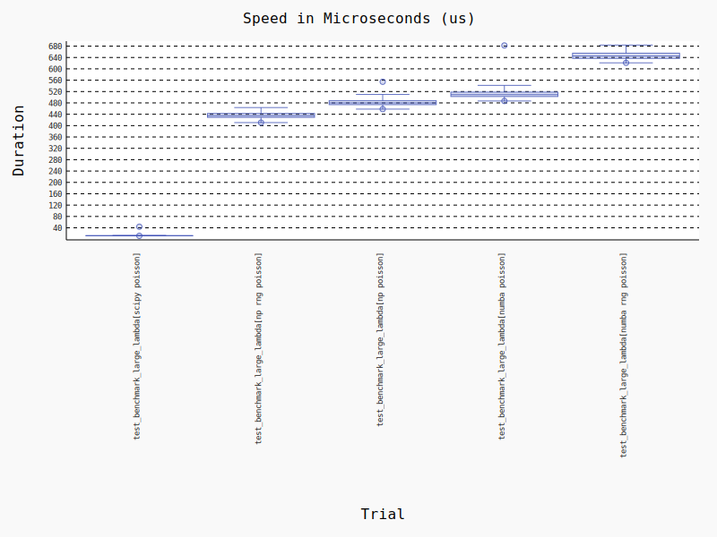
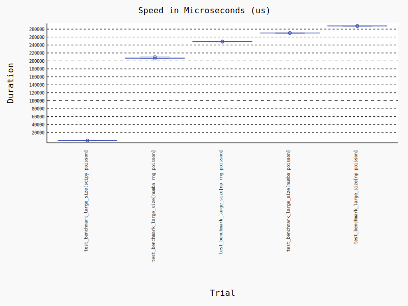
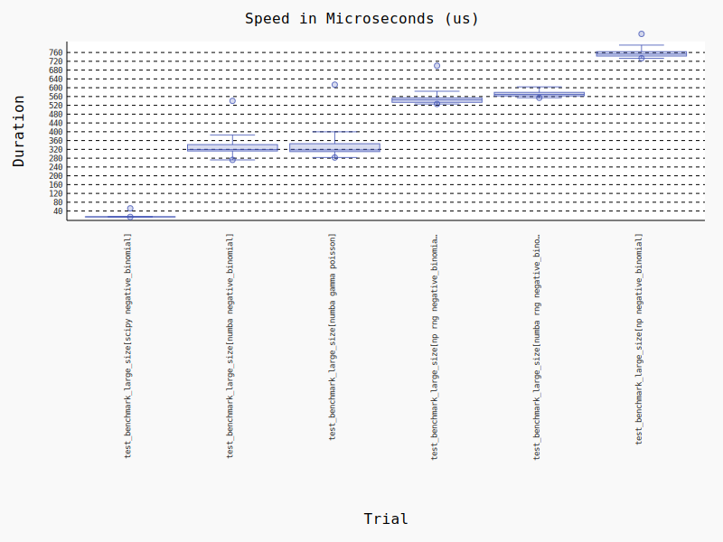

# The Fastest Distribution in the West

Speed comparisons of various distributions from numpy, numba, and scipy.

## Results

### Poisson
```
lambda = 20
size = 10_000
```
Quickest is `scipy.stats.poisson.rvs`, followed by numpy's `rng.poisson`.
 

```
lambda = 1
size = 10_000_000
```
Again, quickest is scipy's implementation, however second quickest is the `rng.poisson` wrapped in numba `@njit`
decorator.
 


### Negative binomial
```
n = 2
p = 0.5
size = 10_000
```
Quickest is `scipy.stats.nbinom.rvs`, followed jointly by `@njit` decorated negative binomial and gamma poisson
implementations. The speed similarity is due to the numba's internal implementation calculating a gamma poisson in an
identical fashion.
 

## Installing
```bash
poetry install
```
Afterwards, run benchmarks via `pytest`.
